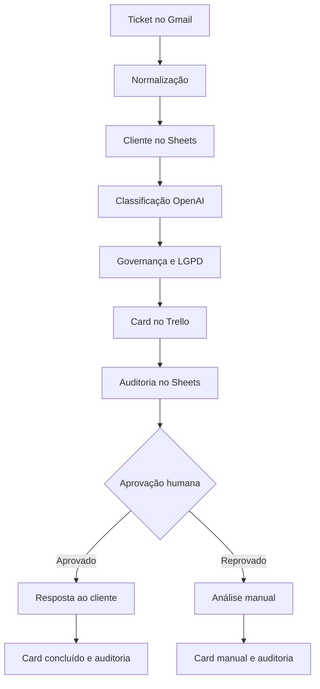

# NexaTriage AI

Fluxo inteligente de triagem de tickets com n8n, OpenAI, Gmail, Google Sheets e Trello. A IA sugere; regras determinísticas validam prioridade, roteamento e risco; uma pessoa decide se a resposta pode ser enviada.

Projeto adaptado de [`sabbrinaa-cloud/saaspro-ai-ticket-triage`](https://github.com/sabbrinaa-cloud/saaspro-ai-ticket-triage), preservando a licença original.

## O que foi aprimorado

- Gmail como canal real de entrada, por polling de mensagens não lidas.
- Consulta determinística do cliente no Google Sheets antes da classificação.
- Saída estruturada da OpenAI com categoria, prioridade, equipe, confiança e resposta.
- Motor de governança em JavaScript que prevalece sobre a decisão do modelo.
- Elevação automática para incidentes de produção, indisponibilidade, perda de dados e clientes Enterprise/Corporate.
- Detecção preventiva de CPF, CNPJ, cartão, credenciais e dados sensíveis.
- Redação segura para LGPD sem ecoar o dado detectado.
- Aprovação humana obrigatória via Gmail antes de qualquer resposta ao cliente.
- Cards Trello com prioridade, equipe, protocolo e etiquetas configuráveis.
- Trilha de auditoria no Sheets para triagem, aprovação, envio ou reprovação.
- Remoção de IDs, e-mails e recursos pessoais fixos do projeto original.

## Fluxo



## Requisitos

- n8n 1.107.4 ou versão compatível.
- Credenciais OAuth2 do Gmail com leitura e envio.
- Credencial OpenAI.
- Credencial Google Sheets; conta de serviço ou OAuth2.
- Credencial Trello.
- Um board Trello com listas `Novos`, `Concluídos` e `Análise manual`.
- Etiquetas Trello para `Crítica`, `Alta`, `Média`, `Baixa`, `LGPD` e `Fora do escopo`.

## Instalação

1. Copie `.env.example` para `.env` e substitua todos os valores `replace-with-*`.
2. Crie uma planilha e importe `config/clientes.csv` na aba `Clientes` e `config/auditoria.csv` na aba `Auditoria`.
3. Inicie o n8n:

   ```bash
   docker compose up -d
   ```

4. Importe `workflows/nexatriage-ai-ticket-triage.json` no n8n.
5. Associe as credenciais nos nós Gmail, Google Sheets, OpenAI e Trello.
6. Execute manualmente com um e-mail de teste e valide os dois caminhos de aprovação.
7. Somente depois ative o workflow.

Para regenerar e validar o artefato:

```bash
node scripts/generate-workflow.mjs
node scripts/validate-workflow.mjs
```

## Base corporativa

| Campo | Uso |
|---|---|
| `email` | Chave de busca normalizada em minúsculas |
| `empresa` | Identificação corporativa |
| `plano` | `Standard`, `Enterprise` ou `Corporate` |
| `status` | Situação cadastral |
| `sla_horas` | Referência operacional; a IA não promete prazo |
| `equipe_preferencial` | Sobrescreve o roteamento padrão quando preenchido |

## Roteamento

| Categoria | Equipe padrão |
|---|---|
| `bug`, `performance` | Engenharia |
| `security` | Segurança |
| `feature_request` | Produto |
| `billing` | Financeiro |
| `account`, `how_to` | Customer Success |
| `other` | Atendimento manual |

O motor aplica prioridade crítica para sinais de indisponibilidade, produção, perda de dados ou vazamento. Cliente Enterprise/Corporate sobe um nível quando a prioridade calculada é baixa ou média.

## Governança e segurança

- Nenhuma resposta é enviada sem decisão humana explícita.
- Confiança abaixo de `0.72`, cliente não localizado, LGPD ou fora do escopo exigem análise manual destacada.
- A auditoria mascara o e-mail e registra somente metadados da decisão.
- O card evita copiar o corpo integral do e-mail.
- Segredos ficam nas credenciais do n8n ou no `.env`; não devem ser versionados.
- Em produção, use HTTPS, PostgreSQL externo, queue/worker mode, backup da chave de criptografia, RBAC/SSO e política de retenção de execuções.
- Para LGPD real, complemente regex com DLP corporativo, base legal, retenção, canal seguro e processo de incidente.

## Testes mínimos

- Ticket técnico comum: card, aprovação e envio.
- Incidente de produção: prioridade crítica.
- Cliente Enterprise: elevação de prioridade.
- Cliente inexistente: revisão manual.
- CPF, cartão ou credencial: etiqueta LGPD e conteúdo não repetido.
- Spam ou assunto pessoal: fora do escopo.
- Reprovação: sem resposta e card em análise manual.
- Falhas de OpenAI, Gmail, Sheets e Trello: erro visível e reprocessamento controlado.

## Estrutura

```text
.
├── .env.example
├── config/
├── scripts/
├── workflows/nexatriage-ai-ticket-triage.json
├── docker-compose.yml
├── LICENSE
└── README.md
```

## Limites conhecidos

- IDs de listas e etiquetas são específicos de cada Trello e precisam ser configurados.
- A autenticação é concluída na interface do n8n e não pode ser distribuída no JSON.
- `sendAndWait` mantém a execução aguardando decisão; para alto volume, prefira subworkflow de aprovação com webhook e banco de estado.
- Não ative o workflow antes dos testes com uma caixa Gmail e board não produtivos.
